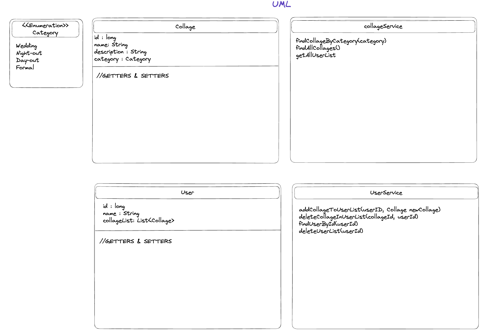
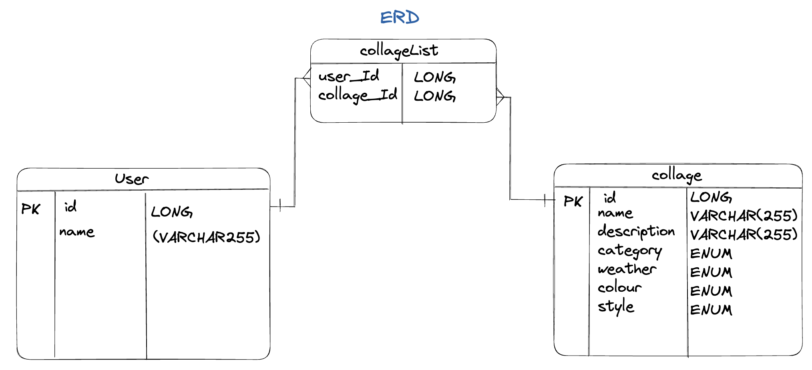
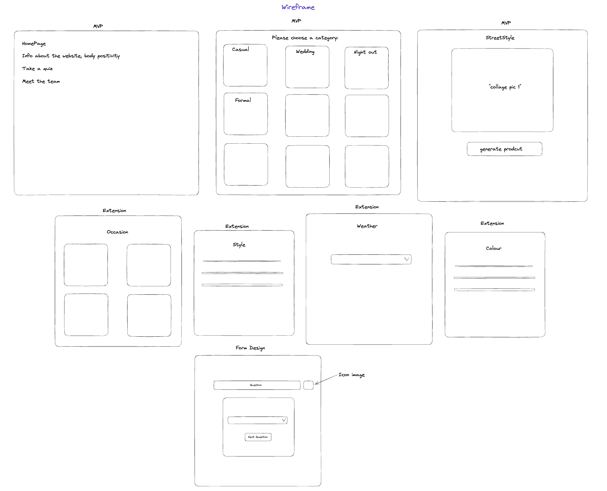
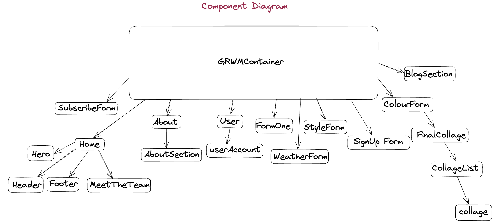

# GRWM (Get Ready with Me) Capstone Project 👗

## Collaborators

- Chinika Charles (GitHub: [ChinikaC](https://github.com/ChinikaC))
- Aya Hezam (GitHub: [aya-rh](https://github.com/aya-rh))
- Samra Afzaal (GitHub: [samra-a](https://github.com/samra-a))
- Diana Eboegbulem (GitHub: [PrincessDiana1](https://github.com/PrincessDiana1))

## Table of Contents
1. Project Description
2. Diagrams
3. Tech Stack
4. RESTful Route Endpoints
5. Setup Instructions
6. Future

## 1. Project Description

As part of our capstone project, we had to create an API and the client-side for the API in less than two weeks. Our group decided to base our project on personalised outfit inspirations whilst also promoting body positivity, as this was something we had not seen before and we wanted to set ourselves a challenge. This ‘Get Ready with Me’ website is a styling platform, designed with the user in mind allowing women to embrace their individual sense of style by making chosing an outfit easy. There is a short quiz for the user to fill out and once they have done this outfit collages will be generated, using an algorithm, based on the user's answers.

## 2. Diagrams

### UML

Our UML includes our models, enum and service layer. All of our methods are displayed here.

### ERD

Our ERD displays the many-to-many relationship that we had between the collage and user - each user could end up with many collages and each collage can be assigned to many users. As a result, we only needed one join table, the 'collageList'.

### Wireframe

Our wireframe shows what our MVP was, and a rough idea of how we intended our website to look like. We seperated the sections by MVP and extension so we could organise our time better.

### Component Diagram

Our component diagram showcases the different sections that we had in our JavaScript file. We have our main GRWMContainer, pages and components and how they link to one another.

## 4. RESTful Route Endpoints

To gain access to the website, use `https://localhost:{port}/{endpoint}` - the default port is **8080**. To navigate to the different sections, follow the endpoints below:

**Users:** 

1. `GET http://localhost:8080/users` - this will return all users.

2. `GET http://localhost:8080/users/{userId}` - this will return a specific user.

3. `POST http://localhost:8080/users/{userId}/collages/{collageId}` - this will add a specific collage, using it's id, to a specific user.

4. `PUT http://localhost:8080/users/{userId}/collage/{collageId}`- this will remove a specific collage from the user's list. When the GET request '`GET http://localhost:8080/users/{userId}`' is performed after this to retrieve a specific user, their updated list should display.

5. `DELETE http://localhost:8080/users/{userId}` - this will delete a user's whole list of collages.

**Collages:**

1. `GET http://localhost:8080/collages` - this will retrieve all of the collages.

2. `GET http://localhost:8080/collages/users/{userId}` - this will retrieve a specific user's list of collages.

## 5. Setup Instructions 

Server-side API Instructions:
1. Ensure the following are installed on your machine:
- Intellij IDEA , running with JDK 17
- Postgres
- Postman
- Postico

2. Clone the repository from GitHub. Scroll to the top of this page and click on the green Code button. Ensure SSH is selected and copy the link provided, or you can copy the link here: `git@github.com:samra-a/Capstone_Project_GRWM.git`. In your terminal, perform the following command:
`git clone git@github.com:samra-a/Capstone_Project_GRWM.git`

3. Create a new PostgreSQL database named 'grwm_capstone' anywhere in your terminal.
`createdb grwm_capstone`

4. Via Intellij IDEA, run the 'CapstoneApplication' and make sure the API is running on port 8080.

5. To ensure the endpoints are working as expected, you can test them using Postman. All endpoints are available in this [link](https://github.com/samra-a/Capstone_Project_GRWM).

Client-side API Instructions:
1. Ensure the following are installed on your machine:
- Visual Studio Code

2. Clone the repository from GitHub. Scroll to the top of this page and click on the green Code button. Ensure SSH is selected and copy the link provided. In your terminal, perform the following command:
`git clone git@github.com:samra-a/Capstone_Project_GRWM.git`

3. Install node modules.

4. In your terminal, perform the following command: `npm install` or `npm i`

5. Install React Icons - in your terminal, perform the following command: `npm i react-icons`

6. Install React Slick - in your terminal, perform the following command: `npm i react-slick`

7. Install React Router - in your terminal, perform the following command: `npm install react-router-dom@6`

8. Run React App.

9. In your terminal, perform the following command: `npm start`. The App should automatically open in the browser. If it doesn't, you can manually navigate to http://localhost:3000 using your preferred browser.

**DISCLAIMER:** All images used in this project were for educational purposes only. No Copyright Infringement Intended.

